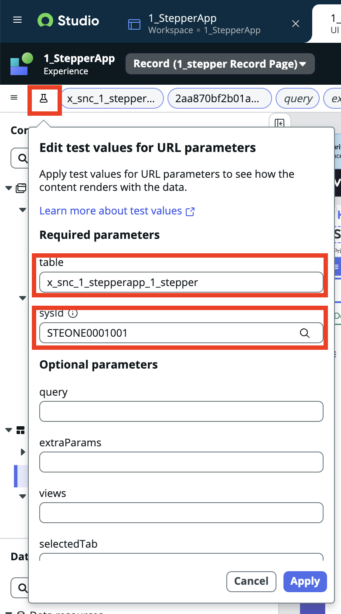

<!--
title:   ServiceNow Workspaceのカスタマイズ - Stepperの設定方法 Yokohama以降
tags:    ServiceNow
id:      
private: true
-->
# Stepperの設定方法

## 前提

- 以前記載したStepperの設定方法と現時点での設定方法に変更があったため、[こちら](https://qiita.com/tomoki_gozu/items/2cab9db63d57ae75c2ce)の補足記事です。

## 準備

- 上記記事と同様に、下記を用意してください。

- Stepperを追加したいアプリの用意
  - [ ] Workspace
  - [ ] Playbook

- 前回の事前準備セクションの実行

## Stepperの追加・編集

- Stepperを追加したいレコードが存在するWorkspaceで**UI Builder**を開きます。


:::note info 適切なアプリケーションスコープが表示されない場合

[こちら](https://www.servicenow.com/community/next-experience-blog/ui-builder-essentials-troubleshooting-guide/ba-p/3191130#:~:text=Within%20your%20page%20variant%20editor,Developer%20%3E%20Clear%20UI%20Builder%20Cache.)のDocumentに従って、UI Builder上のキャッシュをクリアしてください。


:::

## プリセットの適用

### テストデータの準備

- UI Buiderを開いた時点では、**test value**が入力されておらず、設定に必要な**Pill**が見つからないため、UI Builderの左上アイコンから、**Table Name**とレコードを追加
- (レコードが追加されていないとき、アイコンマークが黄色の三角形表示です。)



### (前回の内容と同様)プリセットの設定

- Body内に**Stepper**を追加し、プリセットを適用する手順までは前回の記事と同様です。


<!-- - プリセット適用前の画面はこちらです。

 -->

- 以前のバージョンでは、プリセットを選択することで、自動的に該当レコードに対して設定がされましたが、Yokohamaバージョンからは、プリセットを適用したいテーブル情報を追記する必要があります。

- parent sysid, parent tableに対して、下記props内からデータを配置することでこちらの設定が可能です。


### 表示内容変更

- プリセットで定義されているPlaybookのアクティビティの表示からステージの表示に変更します。

``` diff_javascript
/**
 * @param {params} params
 * @param {api} params.api
 * @param {TransformApiHelpers} params.helpers
 */
function evaluateProperty({ api }) {
	const playbooksByContextId = api.data.playbook_custom_layout_1.playbooksByContextId;
	const selectedItem = api.data.playbook_custom_layout_1.selectedItem;

	if (!playbooksByContextId || !Object.keys(playbooksByContextId).length)
		return;

	if (!selectedItem || !selectedItem.playbookContextId) return;

	const cardProgressMapping = {
		// ADD MORE PROGRESS-STATE MAPPING
		// OR CHANGE EXISTING ONES HERE
		PENDING: 'none',
		ERROR: 'none',
		CANCELLED: 'none',
		IN_PROGRESS: 'partial',
		SKIPPED: 'done',
		COMPLETE: 'done'
	};
	const cardIconMapping = {
		// ADD MORE ICONS-STATE MAPPING
		// OR CHANGE EXISTING ONES HERE
		CANCELLED: 'circle-close-outline',
		SKIPPED: 'circle-next-outline',
		COMPLETE: 'circle-check-outline',
		ERROR: 'triangle-exclamation-outline',
		SCHEDULED: 'circle-outline',
		READY: 'circle-outline',
		IN_PROGRESS: 'pencil-outline'
	};
	const lanes = playbooksByContextId[selectedItem.playbookContextId].lanes;
	const flattenedActivities = [];
	lanes.forEach((lane) => {
+    flattenedActivities.push({
+      id: lane.contextId,
+      label: lane.title,
+      disabled: false,
+			 progress: cardProgressMapping[lane.state.value]
      });
	});

- 	lanes.forEach((lane) => {
- 		lane.cards.map((card) => {
- 			flattenedActivities.push({
- 				id: card.contextId,
- 				label: card.title,
- 				disabled: false,
- 				//icon: cardIconMapping[card.state.value],
- 				progress: cardProgressMapping[card.state.value]
- 			});
- 		});
- 	});

	return flattenedActivities;
}
```
## Stepper適用後

- 上記設定が完了すると、Playbookのステージごとの進捗をStepperとして表示でき、それぞれのステージの進捗状況についても視認できるようになります。


## Appendix - Playbook表示位置の変更

- Playbookを適用した際、レコード上では下記画面のように一番右側にタブとして表示されると思います。
- Playbook起点でユーザにインプットを実行させたい業務の場合、タブ移動することなく、レコード表示の初期画面をPlaybookにするカスタマイズを追記します。


- UI Builder 左側ペイン > Body > Resizeble Pane > left > Main tab
- に移動し、右側ペインのTabsを確認します。


- こちらのPlaybook Tabを表示させたい箇所(今回は一番上)に移動させることで、Workspace上のレコードのタブ位置を変更できます。


