<!--
title:   ServiceNow Workspaceのカスタマイズ - Stepperの設定方法
tags:    ServiceNow
id:      2cab9db63d57ae75c2ce
private: true
-->
# Stepperの設定方法

## memo

## 今回作成するもの

- [Stepper](https://developer.servicenow.com/dev.do#!/reference/next-experience/quebec/now-components/now-stepper/uib-setup)
  - Workspace利用時にPlaybookの進捗状況を、Playbookタブを開くことなく確認できるコンポーネント
  - Core UI上の[Process Formatta](https://www.servicenow.com/docs/csh?topicname=r_ProcessFlowFormatter.html&version=latest)と同等の機能をWorkspace上で実現するために利用可能です。

## 事前準備

- App Engine等でアプリケーションの作成
- Workspaceの作成
- Playbookの作成

### 今回作成したPlaybook

利用するPlaybookはこちらです。
今回は中身は利用せず、LaneとActivityの名前を利用するため枠のみ作成しています。

#### 開発画面

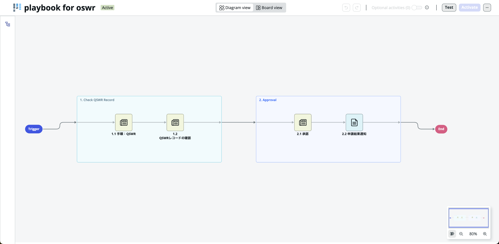

#### レコード画面

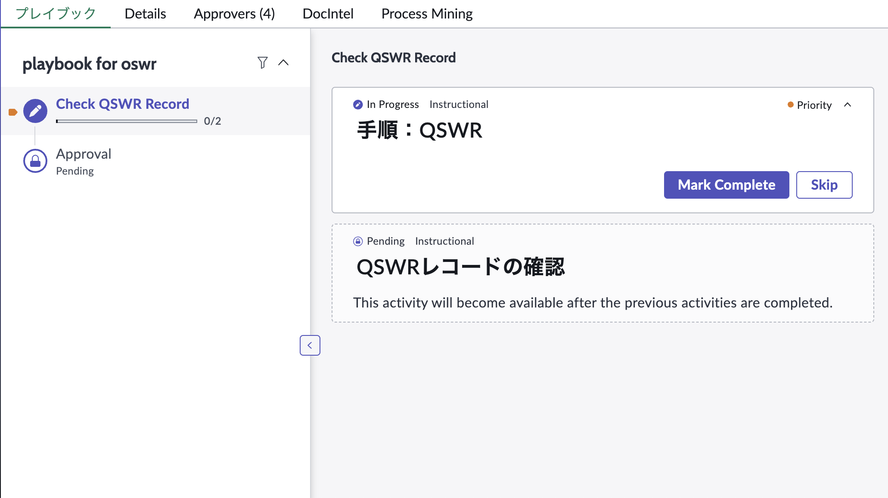

## Steperの追加・編集

### Stepperの追加

まず、Stepperを追加したいレコード画面をUI Builderでひらきます。
Bodyの右側にある縦の３点リーダから**Add Content**を選択しStepperコンポーネントを追加していきます。

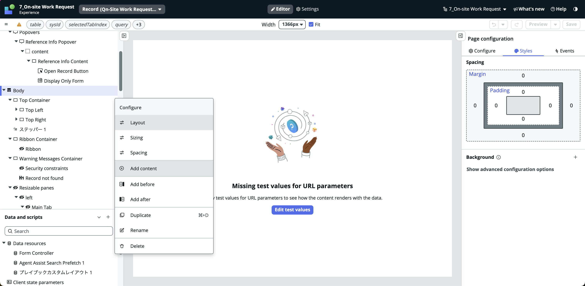
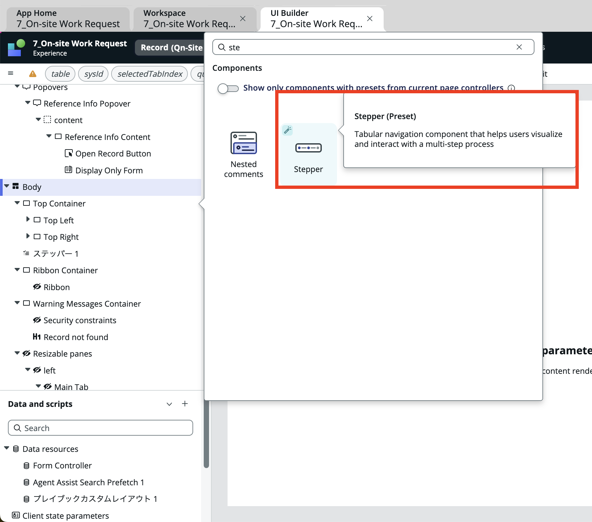

Stepperを追加した後、コンポーネントをクリックすることでStepperの編集が可能です。
プリセットを利用することで、素早くPlaybookの内容を反映できるようになっています。

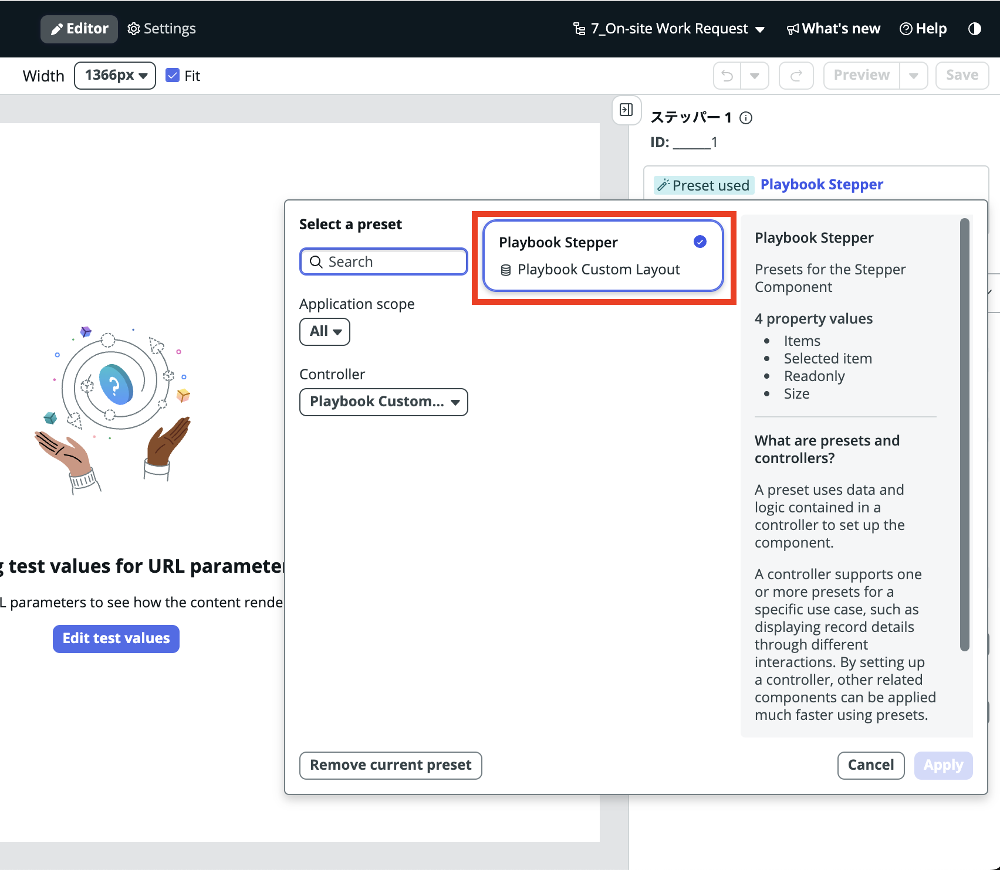

デフォルトでは画面のように、Playbookに存在するすべてのActivityがStepperに表示されるようなスクリプトが適用されています。

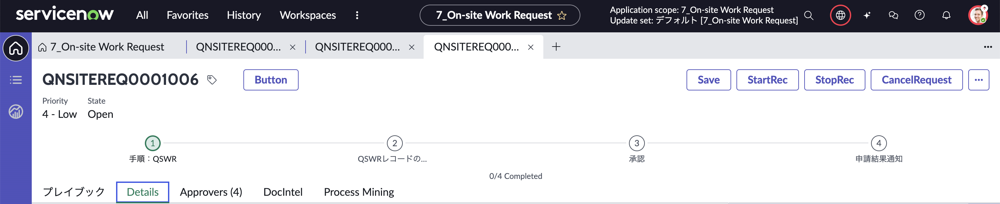

### Steperの編集

しかしながら、現実にはステータスとしてLaneの値をトラッキングしたいことの方が多いかと思います。
今回はここからスクリプトの中身Laneの値を表示させるように変更を加えていきます。

スクリプトを変更していく際に、それぞれのアイテムが持つデータ構成については下記手順を進めていただくことで、JSON形式で確認できます。

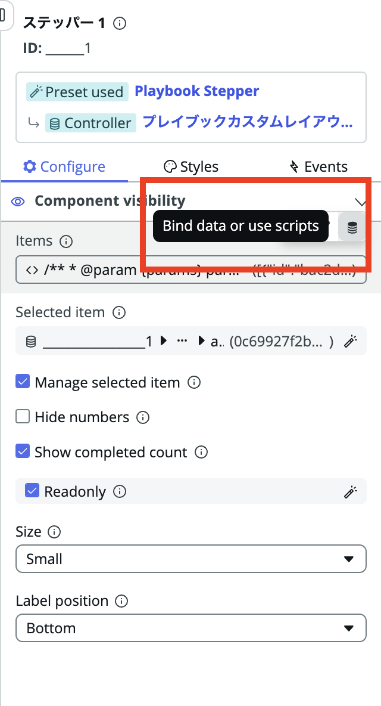
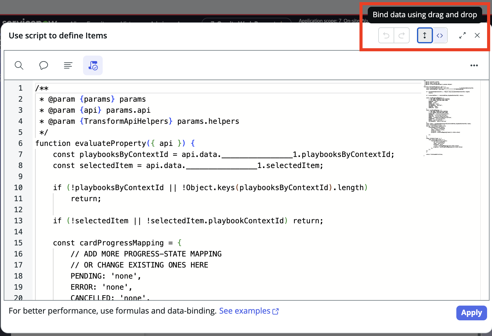
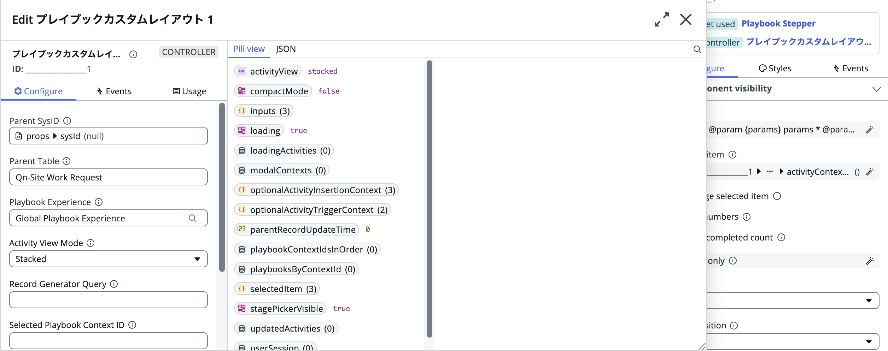

上記から抜き出したいLanesの構成を確認し、スクリプトに適用していきます。

``` diff_javascript
/**
 * @param {params} params
 * @param {api} params.api
 * @param {TransformApiHelpers} params.helpers
 */
function evaluateProperty({ api }) {
	const playbooksByContextId = api.data.________________1.playbooksByContextId;
	const selectedItem = api.data.________________1.selectedItem;

	if (!playbooksByContextId || !Object.keys(playbooksByContextId).length)
		return;

	if (!selectedItem || !selectedItem.playbookContextId) return;

	const cardProgressMapping = {
		// ADD MORE PROGRESS-STATE MAPPING
		// OR CHANGE EXISTING ONES HERE
		PENDING: 'none',
		ERROR: 'none',
		CANCELLED: 'none',
		IN_PROGRESS: 'partial',
		SKIPPED: 'done',
		COMPLETE: 'done'
	};
	const cardIconMapping = {
		// ADD MORE ICONS-STATE MAPPING
		// OR CHANGE EXISTING ONES HERE
		CANCELLED: 'circle-close-outline',
		SKIPPED: 'circle-next-outline',
		COMPLETE: 'circle-check-outline',
		ERROR: 'triangle-exclamation-outline',
		SCHEDULED: 'circle-outline',
		READY: 'circle-outline',
		IN_PROGRESS: 'pencil-outline'
	};
	const lanes = playbooksByContextId[selectedItem.playbookContextId].lanes;
	const flattenedActivities = [];

+    for(var i=0;i<lanes.length;i++){
+        flattenedActivities.push({
+            id: lanes[i].contextId,
+            label: lanes[i].title,
+            disabled: false,
+            progress: cardIconMapping[lanes[i].state.value]
+
+        });
+    }

- 	lanes.forEach((lane) => {
- 		lane.cards.map((card) => {
- 			flattenedActivities.push({
- 				id: card.contextId,
- 				label: card.title,
- 				disabled: false,
- 				//icon: cardIconMapping[card.state.value],
- 				progress: cardProgressMapping[card.state.value]
- 			});
- 		});
- 	});
	return flattenedActivities;
}
```

上記スクリプトを適用することでLaneの値をStepperに表示させることができました。

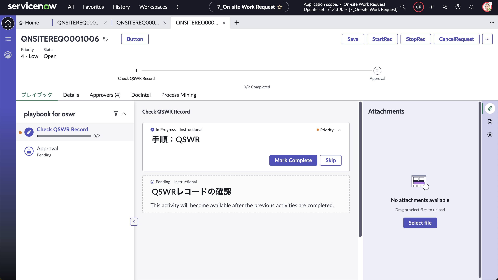

## Tips

### Playbook - 名称変更

- バージョンによって日本語開発時、Playbookの名前が変更できないバグが存在する場合があります。
- その場合は下記手順でPlaybookレコードにアクセスし、直接名前を修正する必要があります。
- Filter Nabigator Menu > sys_pd_process_definition.LIST > 該当Playbookレコード

### UIB

- UI Builderで画面中央に実レコード画面を出力するにはテスト値を入力する必要があります。
- 画面左上部で設定可能です。

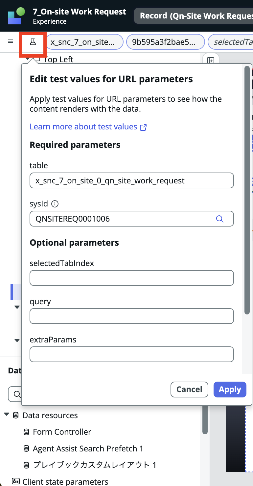

### Stepper - 完了数

Stepperの下部に完了の数が表示されているかと思います。
こちらは今回の手順の中では記載しておりませんが、クリック一つで表示可能です。

Stepperの編集画面下部の**Show completed count**をTrueに変えてあげることで実現できます。

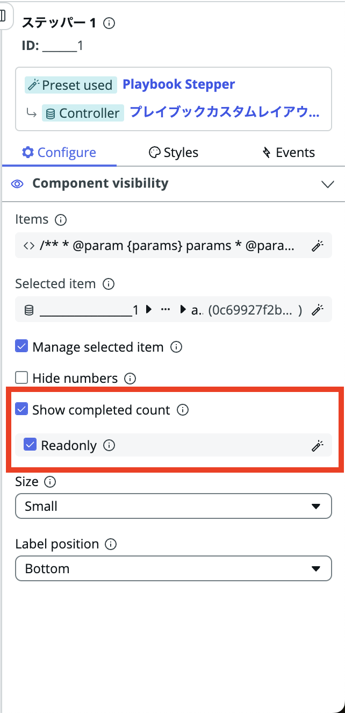
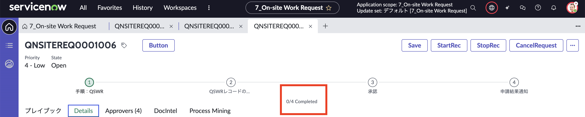