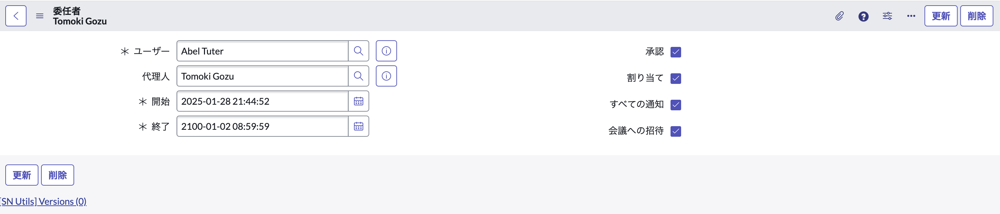
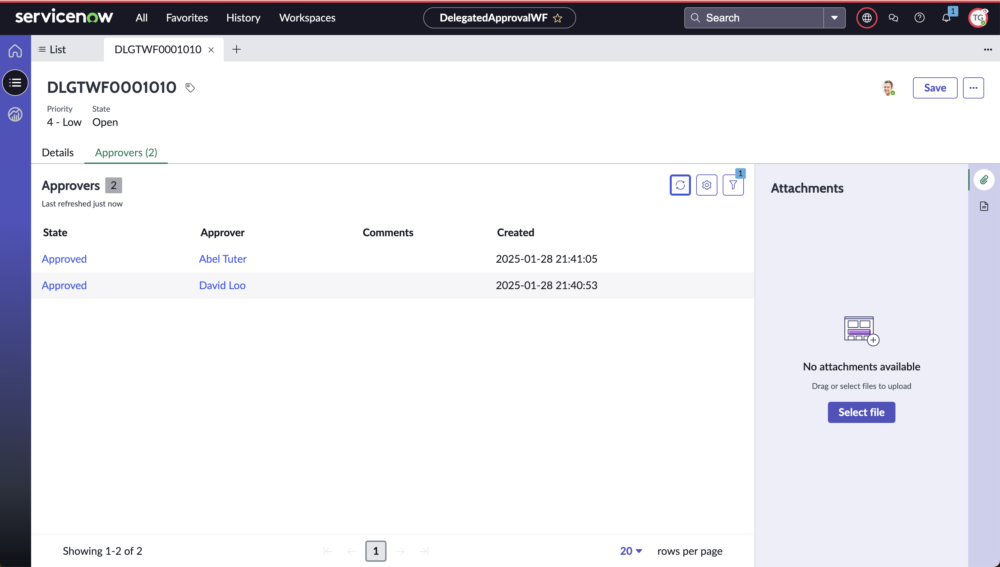

<!--
title:   ServiceNowにおける代理人機能の動作について
tags:    ServiceNow
id:      1acaeb58889afb11eb08
private: true
-->

# 代理承認

## 代理承認の実現

- 代理承認の実現方法
  - レコードプロデューサ -> flow
  - if(approve) tmp table -> sys_user_delegate
- 今回実行するケース
  1. 既にUserに承認レコードが配布されているとき、Delegated Userが代理人としてアサインされた場合
  2. Delegated Userが代理人期間にUserの承認レコードが配布されており、承認されないまま代理人期間が終了した場合
  3. Delegated Userが代理人にアサインされたとき、既にWFが開始されているが、Userに対するAsk for approvalは動いていない場合
  4. Delegated Userが代理人にアサインされている時にWFが開始されたが、Ask for approvalが動作する際には代理人期間が終了している場合

## 事前準備

### Flow の構築

今回は２段階の下記承認WFを作成し、2次承認者の'Abel Tuter'に代理承認機能を適用し進めていきます。

### 代理承認依頼

ServiceNowでは代理承認に関するテーブルが'**sys_user_delegate**'として用意されています。
今回はUser:Abel Tuter(以後A), Delegated User:Tomoki Gozu(以後D)として下記操作を進めていきます。

## 代理人機能の動き

OOTBでは代理人として他ユーザを設定すると、代理人のNotificationsに通知が来るようになっています。

これらの前提のもと、下記4つのケースの場合に代理人機能がどのように動作するのかを実画面で紹介していきます。

### 1. 既にAに承認レコードが配布されているとき、Dが代理人としてアサインされた場合

まずはユースケースの1つ目として、代理人レコード作成前にAにアサインされている承認レコードの動きを見ていきます。
**DLGTWF0001010**としてレコードを作成し、1人目の承認を実行していきます。

ケースの条件に合う形式でレコードを準備したら、承認レコードが配布された時間(2025-01-28 21:41:05)移行開始の代理人レコードを作成します。

代理人レコードを作成した上で、Dとして**DLGTWF0001010**のレコードを確認していきます。
すると、１つ前に実行したDavid Looの承認レコードは編集できませんが、代理人設定を行ったAbel Tuterの承認レコードは編集できるため、1のケースは代理人機能が生きている状態ということが確認できます。

### 2. Dが代理人期間にAの承認レコードが配布されており、承認されないまま代理人期間が終了した場合

ケース１で利用した代理人レコードを残したまま、同様にDLGTWFレコードを作成し、1人目の承認まで実行します。

DLGTWFレコードの準備が完了したら、ケース１で作成した代理人レコードを削除し、Dとして**DLGTWF0001012**を開きます。
レコードを確認すると、ケース１では編集できたAbel Tuterの承認レコードが編集できないように変更されていることがわかります。

### 3. Dが代理人にアサインされたとき、既にWFが開始されているが、Aに対するAsk for approvalは動いていない場合

代理人レコードが作成されていないことを確認し、DLGTWFレコードを作成します。
1人目の承認者へレコードが配布されたことを確認し、新たな代理人レコードを作成します。

1人目の承認を実施し、Abel Tuterに来ている承認レコードを確認すると代理人機能が動作していることがわかります。

### 4. Dが代理人にアサインされている時にWFが開始されたが、Ask for approvalが動作する際には代理人期間が終了している場合

最後にケース3のまま新しいDLGTWFレコードを作成し、ケース３で作成した代理人レコードを削除します。
代理人レコードの削除後に、Abel Tuterに承認レコードが配布されるまでWFを進めます。

レコードの見た目上ケース２とほとんど変わりませんが、代理人機能は動作せず対象者のみ編集できるようになっていることがわかるかと思います。

## まとめ

ここまで、WFの起動時を場合分けするかたちで代理人機能の動作を紹介していきました。

ServiceNowにおける代理人機能はWF起動のタイミングではなく、設定された機関によって代理人行為を履行できることがわかったかと思います。

ただ、あくまで下記'サービスの委任'に記載されている内容をServiceNowインスタンス上で実行した内容になるため、より詳細な内容についてはご自身の環境や開発用インスタンスで試すことをお勧めします。

[公式Document: サービスの委任](https://www.servicenow.com/docs/ja-JP/bundle/xanadu-servicenow-platform/page/use/employee-self-service/concept/c_ServiceDelegation.html)

[公式Document: 詳細な委任](https://www.servicenow.com/docs/csh?topicname=t_DelegateApprovalsTasks.html&version=latest)

## 実装が必要なものメモ

- [ ] User: Abel Tuter
- [ ] Delegated User: Any user (without admin role)
- [ ] Clean up for 'sys_user_delegate' table for each case
- [ ] WF
  - ask for approval to X user whoever
  - ask for approval to Abel Tuter
- [ ] Set Up Due Date for Delegation
- [ ] Workspace