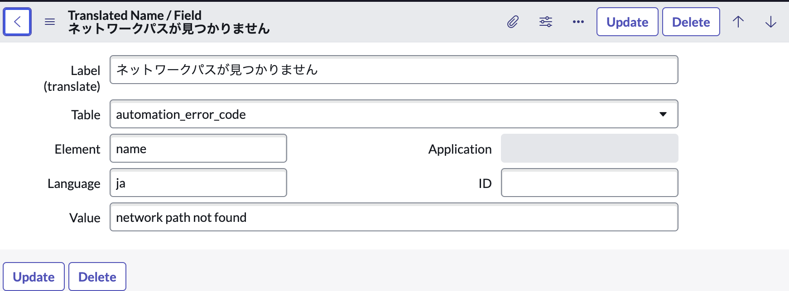
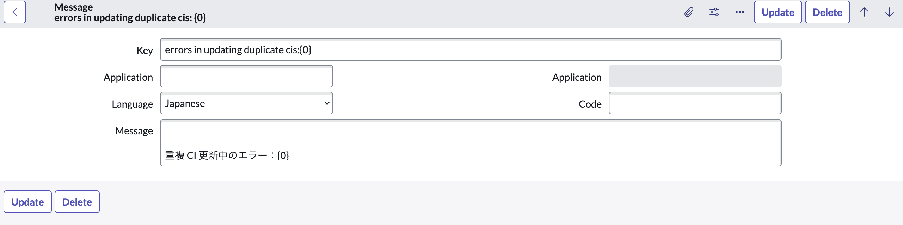
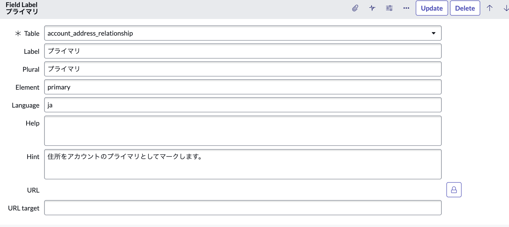
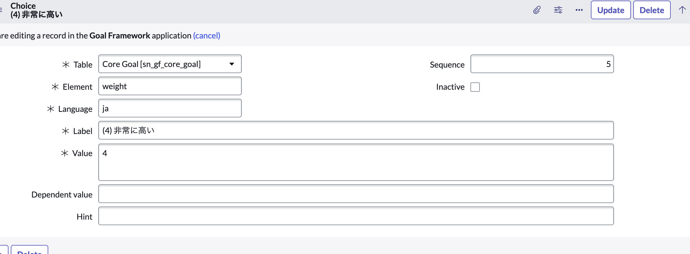
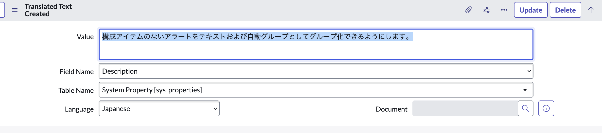

<!--
title:   ServiceNow Instanceの基本的な日本語化
tags:    ServiceNow
id:      f1a29730df3f4922fc4f
private: false
-->

# ServiceNow Instance Localization

## 目次

- [はじめに]
- [日本語化の流れ]
- [基本的な日本語化]
- [Custom Localization]

## はじめに

この記事はInstanceを日本語化した際に得た、個人的な勉強内容をまとめたものです。

公式Document：<https://docs.servicenow.com/en-US/bundle/vancouver-platform-administration/page/administer/core-configuration/concept/p_Localization.html>

## 日本語化の流れ

1. pluginのインストール

ServiceNowで日本語を利用する際にはPluginを導入していただく必要があります。
こちらは無償で利用できるものとなっており、FilterNavigationMenu から All > Plugin で移動し、検索バーからJapaneseでたどり着くことができます。
Installに少し時間を要しますが、こちらが完了すると日本語を利用できる環境が出来上がります。

2. 日本語化を希望するアプリケーションの特定

PluginのInstall終了後。

## 基本的な日本語化

1. 言語の変更

**Japanese Pluginをインストールしている必要があります**

２パターンで表示言語の変更ができます。

１ ログイン済み

    ログイン後のホーム画面 > 右上アイコン > Preference > Display > Language > Japanese > Displayを X 印クリックで閉じる。

２ すでにPluginをインストールされている場合且つ、未ログイン

    ログイン画面 > Language > Japanese

~~カスタムで日本語化していく際、OOTBで日本語化されている場所を先に見つけておくことで重複作業を減らせます。~~

2. タイムゾーンの変更

元々のインスタンスは日本時間に設定されていないため、レコードの作成時間などを日本時間で表示するためにはシステムのタイムゾーンを変更する必要があります。

    System Properties > Basic Configuration UI16 > 'System time zorn for all users unless overridden in the user's record.' > Configure available time zorn

    Available List から Asia/Tokyo を Selected に変更

    Save > Asia/Tokyo

3. 通貨の変更

通貨は$が基本設定になっています。

    System Properties > System Localization > 'Use a single currency model. Display all currencies in the sam currency code, regardless of a user's locale, country, or language code.' > Yes

    'If using the single currency model, display all currencies using this currency code. Currency codes use the ISO 4217 three letter format.' > JPY

上記で変更可能です。
元々$で入れられていた情報も自動で変更されるので、この設定一つで通貨の管理ができます。

これら３点の設定で基本的な操作としては問題ないレベルで日本語化されるので、英語やシステムに不安がある方でも問題なく設定できるかと思います。

## Custom Localization

ここからはLocalizationを行っていく上で、細かい部分まで日本語化を行う場合や、複数言語環境を構築していく必要のある場合に有用な項目です。

### Enable || Disable I18N Debugging

Filter Navigator Menuから下記メニューを押下することで利用可能

    All > System Localization >> Enable I18N Debugging

この機能を有効化することで、表記されている文字の前に翻訳プリフィックスが表示されます。

    例：
        TRT：DemoHub App Home page
        GMLD: Number

これらのプリフィックスは、その文字列がそれぞれどのテーブルで翻訳情報が管理されているか、テーブルに値を追加する方法で翻訳できるかを表示しています。
下記に対応しており、該当するテーブルに情報を入れていくことで、既存の英語情報を消すことなく追加できます。
追加方法については、次の*Table*で説明します。

| プリフィックス | メニュー（テーブル名） |
| ---- | ----|
| TRF | Translated Name / Field (sys_translated) |
| MSG | Messages (sys_ui_message) |
| GMLD | Field Labels (sys_documentation) |
| TRT | Translated Text (sys_translated_text) |
| CHC | Choices (sys_choice) |

[公式Docs][LocalizationDebug]

### Table

こちらでは上記で記載したTableについて追加に必要な情報を簡単に説明します。

#### Translated Name / Field

Translated Name/Field テーブルにはフィールドタイプがtranslation_filedであるテキストフィールドの翻訳された値が保存されます。
このオプションは、長さ255文字までのテキストフィールドで使用できます。

<!--  -->

    Label(translate): ネットワークパスが見つかりません。
    Table: automation_error_code
    Element: name
    Language: ja
    Value:  network path not found

[公式Docs][TranslatedNameFieldTableDocs]

#### Message

メッセージテーブルでは、プラットフォーム全体の情報、確認、エラーおよびシステムメッセージの翻訳が含まれてます。

クライアントスクリプトにgetMessage呼び出しが含まれている場合、またはサーバースクリプトに呼び出しが含まれている場合に、このテーブルで翻訳されたテキスト翻訳されたテキストをチェックします。

<!--  -->

    例：
    Key: errors in updating duplicate clis:[0]
    Language: Japanese
    Message: 重複CI更新中のエラー：[0]

[公式Docs][MessageTableDocs]

#### Field Labels

Field Labelテーブルには、テーブル名のテキストと、テーブル内の各フィールドの単数系および複数形のラベルが格納されます。

ヘルプ：将来の使用のために予約されています。アクセシビリティモードが有効になっている場合、ヒントラベルの横にはてなアイコンがつきます。
ヒント：カーソルがフィールド上にあるときにポップアップするテキスト
URL：フィールドに関する情報を提供するwebページのURL。URLを指定するt、ラベルがクリック可能であることを示すために、テキストが青色で下線つきで表示されます。

<!--  -->

    Table： account_address_relationship
    Label： プライマリ
    Plural: プライマリ
    Element: primary
    Language: ja
    Help:
    Hint: 住所をアカウントのプライマリとしてマークします。

[公式Docs][FieldLableTableDocs]

#### Choices

Choicesテーブルには、選択リストに表示される値の翻訳テキストが含まれてます。

<!--  -->

    例：
    Table: Core Goal [sn_gf_core_goal]
    Element: eight
    Language: ja
    Lable: (4)非常に高い
    Value: 4
    Sequence: 5

[公式Docs][ChoicesTableDocs]

#### Translated Text

Translated Textテーブルには、Translated_textまたはtranslation_htmlのフィールドタイプを持つ翻訳が保持されます。
このフィールドタイプは通常、アンケート名や紹介などながさ65000文字までの長いテキストフィールドに使用されます。

<!--  -->

    Value: 構成アイテムのないアラートをテキストおよび自動グループとしてグループ化できるようにします。
    Field Name: Description
    Table Name: System Property [sys_properties]
    Language: Japanese

[公式Docs][TranslatedTextTableDocs]

### Service Portal

Employee PortalやCustomer Portalなどのポータルをローカライズしていると、ここまでに紹介した方法では変更されていない、変更できない部分が出てくると思います。以降はそのポータルに付随するローカリゼーションの方法を紹介します。

    Service Portal > Service Portal Configuration

こちらにアクセスすると、下記６つのメニューが表示されます。それぞれできることについて簡単に解説します。

1. Branding Editor

こちらではPortalのタイトルやロゴ、色の変更がコーディングすることなくできる画面です。Portalのプレビューを見ながら直感的に操作できるので、非常に簡易的に編集できるかと思います。

2. Designer

ページを選択し、そのページを直接編集できる画面です。ページには複数のWidgetが乗っている構成になっており、ここではそのWidgetの値を変更できるイメージです。Widgetの編集ボタンを押すことでタイトルや、ユーザに見せたい項目の追加・編集ができます。Widgetの位置を変更することもできるので、ポータルに載っているアイテム見た目や位置を変更する機能といえるかと思います。

しかしながら、ここで編集できるのは基本的に静的な項目のみで、動的に表示されるものはWidget Editorで編集する必要があります。

---

Portalの設定を行う際、実際どのページが編集したいのかlabelだけの表示ではわからないことは往々にしてあると思います。
その際は下記からページを特定できます。

    Service Portal > Portals

こちらに移動すると、それぞれのPortalのタイトルURL suffixなどが表示されているので該当Portalのレコードを開きます。
レコード内でHomepageやLogin pageなど項目ごとにレコードが設定されているので、自分が編集したい場所のレコードを開きます。

    Informaiton Mark > Open record > (下にスクロール) > Relatec Links > Open in Designer

上記でもDesignerを開くことが可能なので、該当部分の場所をおぼている方以外はこちらから遷移した方が早いかと思います。

1. Page Editor

2. Widget Editor

こちらではWidget自体の編集ができます。

- HTML Templateplate
- CSS - SCSS
- Client Script
- Server Script
- Link Function

これらの項目があり、動的に表示される項目が主に設定されています。
例えば時間によって画面に表示される挨拶が変わるなど、ユーザの条件によって表示する項目の設定等が可能です。

パッと見コーディングの要素が多い画面に見えますが、HTML Templateの中身を見てみると、ローカライズされていない英語部分の文字列が簡単に見つけられるので、ローカライズのみが目的であればHTML Templateの編集だけで事足ります。

この記事の目的がローカライズなので、他項目についての説明は省きます。

3. New Portal

こちらはポータルを作成できる画面です。
こちらもローカライズには関係がないので省略します。

4. Get Help

Product Documentationのページに遷移しますが、現在(23/11/01)リンクが壊れているようで使用ができないメニューです。

[LocalizationDebug]: <https://docs.servicenow.com/ja-JP/bundle/tokyo-platform-administration/page/administer/localization/task/t_DisplayATranslationPrefix.html>

[MessageTableDocs]: <https://docs.servicenow.com/bundle/vancouver-platform-administration/page/administer/localization/reference/r_MessageTable.html>

[ChoicesTableDocs]: <https://docs.servicenow.com/bundle/vancouver-platform-administration/page/administer/localization/reference/r_ChoicesTable.html>

[FieldLableTableDocs]: <https://docs.servicenow.com/bundle/vancouver-platform-administration/page/administer/localization/reference/r_FieldLabelTable.html>

[TranslatedTextTableDocs]: <https://docs.servicenow.com/bundle/vancouver-platform-administration/page/administer/localization/reference/r_TranslatedText.html>

[TranslatedNameFieldTableDocs]: <https://docs.servicenow.com/bundle/vancouver-platform-administration/page/administer/localization/reference/r_TranslatedNameFieldTable.html>