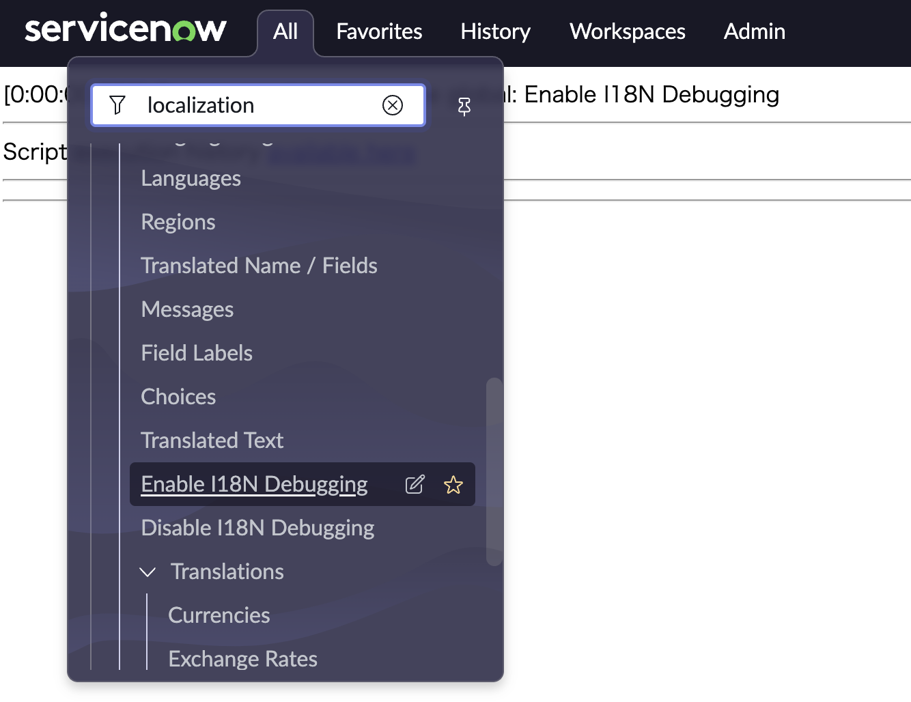

# Instanceの日本語化

## 目次

## 前提

こちらの記事ではServiceNow Instanceのローカリゼーションを行うことで、複数言語で利用できる環境を作成していく具体的な手法を記載していこうと思います。

こちらの ***Enable I18 Debbuging*** をクリックし有効化すると、それぞれのメニューの接頭辞にTRF, MSGのような文字が付与された形で表示されます。

上記記事で記載したとおり、それぞれの接頭辞に紐ついたテーブルがあり、こちらに日本語や変更したい言語の情報を入力することで動的な翻訳が可能になります。接頭辞とテーブルの組み合わせはリンク先を確認してください。

## 申請画面

英語で作成された申請画面かこのように表示されます。

***Enable I18 Debbuging*** を有効化すると、このように画面が表示されます。

まずタイトルから日本語化していきます。

接頭辞にTRTと記載されているので、TRTのテーブルである、***Translated Text***のテーブルに日本語情報を追加します。

## Employee Center

## Service Portal

## Workspace

## VA

## PAD
