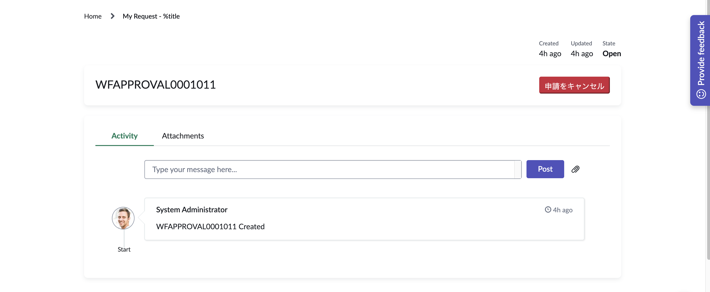
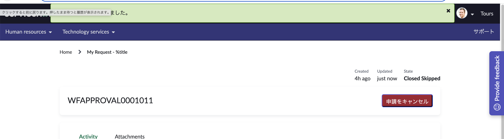

<!--
title:   ServiceNow Instanceの基本的な日本語化
tags:    ServiceNow
id:      204e4c4230189a67d18c
private: false
-->


# 「申請者による取り戻し」の実装メモ

## 完成系

### 自分が申請したレコード



### クリック後



## 構築情報

- 事前設定項目
  - [Standard Ticket Header]Widgetのクローン
  - My Request Filterでポータルページの設定

### HTML

- Widget: Standard Ticket Header
  - 44行目にキャンセルボタンを追加

```html: standard_ticket.html
<button class="cst-btn btn-danger" ng-click="c.cancelRequest()">申請をキャンセル</button>
```

### CSS

- Widget: Standard Ticket Header
  - classに命名
  - 命名に従って下記追加

```css: standard_ticket.css
.cst-btn {
    display: block;
    width: 150px;
    height: 36px;
    line-height: 36px;
    text-align: center;
    margin-left: auto;
    text-decoration: none;
    border-radius: 4px;
}
```

### Client Script

- Widget: Standard Ticket Header
  - ボタンクリックによってサーバにキャンセルリクエストの送信
  - ServiceNowが用意しているアラートを使用しない場合はalertで代用
    - キャンセル成功の場合、失敗の場合にメッセージが出るよう設定

```JavaScript: standard_ticket_client.js
// 申請キャンセル機能
c.cancelRequest = function() {
    var confirmCancel = confirm("本当に申請をキャンセルしますか？");
    if (confirmCancel) {
        // サーバーにキャンセルリクエストを送信
        c.data.action = 'cancel';
        c.server.update().then(function(response) {
            if (response.success) {
                // alert("申請がキャンセルされました。");
                // 必要に応じて画面を更新
                c.data.status = 'cancelled';
            } else {
                // alert("キャンセルに失敗しました。");
            }
        });
    }
};
```

### Server Script

- Widget: Standard Ticket Header
  - 画面に表示されているレコードのテーブル情報を利用し、ステータスを更新
  - ServiceNowのアラートを利用する場合はこちらで設定

```JavaScript: standard_ticket_server

if(input && input.action == 'cancel'){
    var gr = new GlideRecord(tableName);
    if(gr.get(sysId)){
        // レコードのステータスを更新
        gr.setValue('state',7);
        gr.update();
        data.success = true;
        gs.addInfoMessage('申請がキャンセルされました。');
    }else {data.success = false;gs.addErrorMessage('キャンセルに失敗しました。');}
}
```

## メモ

### より業務に合わせた実装にするために必要な項目

- [ ] Client Script側にGlide Modalでポップアップの表示
- [ ] キャンセルボタンをステータスによって非表示