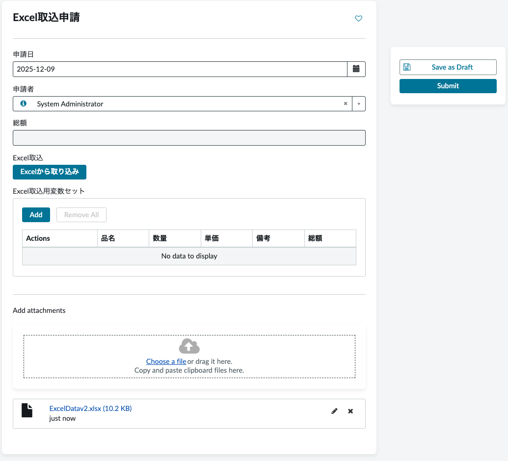
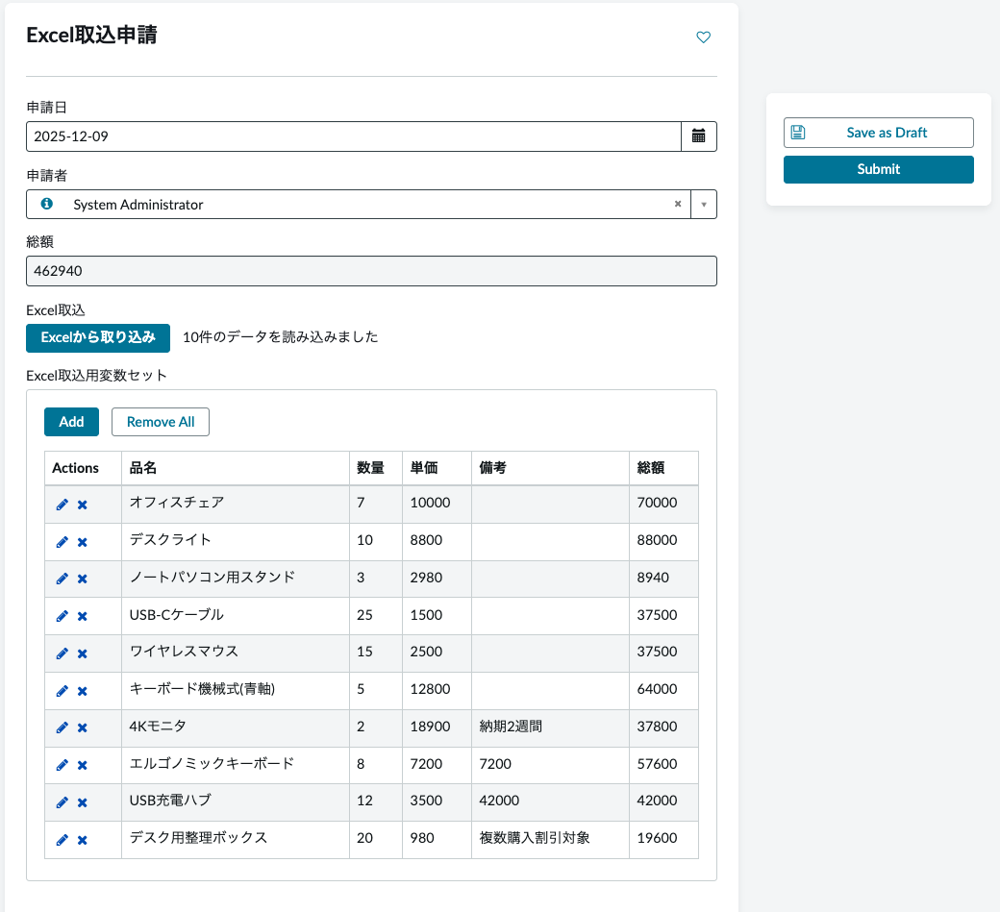

<!--
title:   【ServiceNow】 Record Producer上でのExcel取り込み - Widget
tags:    ServiceNow
id:      45f43b67b358293dbc37
private: true
-->


# 【ServiceNow】 Record ProducerでExcelファイルのMRVS取込メモ

## はじめに

ServiceNowのRecord Producer（Service Portal）で、添付されたExcelファイルを解析し、Multi Row Variable Set（MRVS）に自動で取り込む機能を実装しました。

本記事では、Widgetを使用した実装方法を解説します。

## 完成イメージ

1. ユーザーがRecord ProducerでExcelファイルを添付
2. 「Excelから取り込み」ボタンをクリック
3. Excelの内容がMRVSに自動反映
4. 各行の計算（数量×単価）も自動実行




## アーキテクチャ

```
┌─────────────────────────────────────────────────────────────────────┐
│  Record Producer (Service Portal)                                   │
│                                                                     │
│  ┌─────────────────┐                                               │
│  │ Attachment      │ ← Excelファイルを添付                          │
│  └────────┬────────┘                                               │
│           │                                                         │
│  ┌────────▼────────────────────────────────────────────────────┐   │
│  │ Widget                                                       │   │
│  │  ├─ HTML Template     : ボタンUI                             │   │
│  │  ├─ Client Script     : サーバー呼び出し + MRVS反映          │   │
│  │  └─ Server Script     : GlideExcelParserでExcel解析          │   │
│  └────────┬────────────────────────────────────────────────────┘   │
│           │                                                         │
│           │ $scope.page.g_form.setValue()                          │
│           ▼                                                         │
│  ┌─────────────────────────────────────────────────────────────┐   │
│  │ MRVS: excel_mrvs                                            │   │
│  └─────────────────────────────────────────────────────────────┘   │
└─────────────────────────────────────────────────────────────────────┘
```

## 実装手順

### 1. MRVSの作成

Variable Setを作成し、以下の変数を定義します。

| Name | Type | Question |
|------|------|----------|
| u_mrvs_item | Single Line Text | 品名 |
| u_mrvs_quantity | Single Line Text | 数量 |
| u_mrvs_unit_price | Single Line Text | 単価 |
| u_mrvs_remarks | Single Line Text | 備考 |
| u_mrvs_total | Single Line Text | 総額 |

### 2. Widgetの作成

**Service Portal > Widgets** で新規Widgetを作成します。

#### HTML Template

```html
<div>
    <div>
        <input ng-click="c.importExcel()"
               ng-disabled="c.loading"
               type="button"
               value="{{c.loading ? '処理中...' : 'Excelから取り込み'}}"
               class="btn btn-primary" />
        <span ng-if="c.message" style="margin-left: 10px;">{{c.message}}</span>
    </div>
</div>
```

#### Client Script

```javascript
api.controller = function($scope) {
    var c = this;

    c.loading = false;
    c.message = '';

    // MRVS変数名
    var mrvsVarName = 'excel_mrvs';

    // ExcelキーをMRVS変数名にマッピング
    var mapping = {
        'item': 'u_mrvs_item',
        'quantity': 'u_mrvs_quantity',
        'unit_price': 'u_mrvs_unit_price',
        'remarks': 'u_mrvs_remarks',
        'total': 'u_mrvs_total'
    };

    // Excelインポート処理
    c.importExcel = function() {
        console.log('=== Excel import started ===');
        c.loading = true;
        c.message = '';

        var cartID = getCartID();

        if (!cartID) {
            c.loading = false;
            c.message = 'カートIDが取得できません';
            return;
        }

        // Widget Server Script経由で処理
        c.data.action = 'importExcel';
        c.data.cartID = cartID;

        c.server.update().then(function(response) {
            c.loading = false;
            c.data.action = '';

            // レスポンスからresultを取得
            var result = null;
            if (response && response.result) {
                result = response.result;
            }

            if (result && result.success && result.data && result.data.length > 0) {
                // データをMRVS形式に変換
                var mrvsData = [];
                for (var i = 0; i < result.data.length; i++) {
                    var row = result.data[i];
                    var mrvsRow = {};

                    for (var excelKey in mapping) {
                        if (row.hasOwnProperty(excelKey)) {
                            mrvsRow[mapping[excelKey]] = row[excelKey];
                        }
                    }
                    mrvsData.push(mrvsRow);
                }

                // MRVSにデータを設定
                if ($scope.page && $scope.page.g_form) {
                    var jsonDataString = JSON.stringify(mrvsData);
                    $scope.page.g_form.setValue(mrvsVarName, jsonDataString);

                    // 合計金額を外部フィールドに設定
                    if (result.grandTotal !== undefined) {
                        $scope.page.g_form.setValue('u_total_costs', String(result.grandTotal));
                    }

                    c.message = result.message;
                }
            } else {
                c.message = result ? result.message : 'エラーが発生しました';
            }
        });
    };

    // カートIDを取得
    function getCartID() {
        return getTableIdOrParentScope($scope);
    }

    function getTableIdOrParentScope(scope) {
        if (typeof scope.attachmentHandler !== 'undefined') {
            return scope.attachmentHandler.tableId;
        }
        if (typeof scope.$parent !== 'undefined') {
            return getTableIdOrParentScope(scope.$parent);
        }
        return '';
    }
};
```

#### Server Script

```javascript
(function($sp, data, input) {

    if (input && input.action === 'importExcel') {
        var cartID = input.cartID;
        data.result = parseExcelData(cartID);
    }

    // Excel解析処理
    function parseExcelData(cartID) {
        var result = {
            success: false,
            data: [],
            headers: [],
            grandTotal: 0,
            message: ''
        };

        try {
            var attachment = getExcelAttachment(cartID);

            if (!attachment) {
                result.message = 'Excelファイルが添付されていません';
                return result;
            }

            // 添付ファイル情報をresultに含める
            result.attachment = {
                fileName: attachment.file_name,
                sysId: attachment.sys_id,
                tableName: attachment.table_name,
                searchMethod: attachment.search_method
            };

            // GlideExcelParserで解析
            var parser = new sn_impex.GlideExcelParser();
            var gsa = new GlideSysAttachment();
            var attachmentStream = gsa.getContentStream(attachment.sys_id);

            parser.parse(attachmentStream);

            var sheetNames = parser.getSheetNames();
            if (sheetNames && sheetNames.length > 0) {
                parser.setSheetName(sheetNames[0]);
            }

            var headers = [];
            var rows = [];
            var isFirstDataRow = true;
            var grandTotal = 0;

            while (parser.next()) {
                var row = parser.getRow();

                if (isFirstDataRow) {
                    for (var key in row) {
                        if (row.hasOwnProperty(key)) {
                            headers.push(key);
                        }
                    }
                    isFirstDataRow = false;
                }

                var rowData = {};
                var hasData = false;

                for (var h = 0; h < headers.length; h++) {
                    var headerKey = headers[h];
                    var cellValue = row[headerKey];
                    var sanitizedKey = sanitizeHeader(headerKey);

                    cellValue = (cellValue !== null && cellValue !== undefined)
                        ? String(cellValue).trim() : '';
                    rowData[sanitizedKey] = cellValue;

                    if (cellValue) hasData = true;
                }

                // 総額を計算（quantity * unit_price）
                var quantity = parseFloat(rowData['quantity']) || 0;
                var unitPrice = parseFloat(rowData['unit_price']) || 0;
                var total = quantity * unitPrice;
                rowData['total'] = String(total);
                grandTotal += total;

                if (hasData) {
                    rows.push(rowData);
                }
            }

            var sanitizedHeaders = headers.map(function(h) {
                return sanitizeHeader(h);
            });

            result.success = true;
            result.data = rows;
            result.headers = sanitizedHeaders;
            result.grandTotal = grandTotal;
            result.message = rows.length + '件のデータを読み込みました';

        } catch (e) {
            result.message = 'Excel解析エラー: ' + e.message;
        }

        return result;
    }

    // Excel添付ファイルを取得
    function getExcelAttachment(cartID) {
        var tableNames = ['sc_cart_item', 'sp_portal', 'sc_req_item', 'sc_request'];

        for (var t = 0; t < tableNames.length; t++) {
            var tableName = tableNames[t];
            var gr = new GlideRecord('sys_attachment');
            gr.addQuery('table_name', tableName);
            gr.addQuery('table_sys_id', cartID);

            var qc = gr.addQuery('file_name', 'ENDSWITH', '.xlsx');
            qc.addOrCondition('file_name', 'ENDSWITH', '.xls');

            gr.orderByDesc('sys_created_on');
            gr.setLimit(1);
            gr.query();

            if (gr.next()) {
                return {
                    sys_id: gr.getUniqueValue(),
                    file_name: gr.getValue('file_name'),
                    table_name: tableName,
                    search_method: 'cartID'
                };
            }
        }

        // フォールバック: ユーザーの最新Excel添付を検索
        var grAny = new GlideRecord('sys_attachment');
        var qcAny = grAny.addQuery('file_name', 'ENDSWITH', '.xlsx');
        qcAny.addOrCondition('file_name', 'ENDSWITH', '.xls');
        grAny.addQuery('sys_created_by', gs.getUserName());
        grAny.orderByDesc('sys_created_on');
        grAny.setLimit(1);
        grAny.query();

        if (grAny.next()) {
            return {
                sys_id: grAny.getUniqueValue(),
                file_name: grAny.getValue('file_name'),
                table_name: grAny.getValue('table_name'),
                search_method: 'fallback_user_latest'
            };
        }

        return null;
    }

    // ヘッダ名をサニタイズ
    function sanitizeHeader(header) {
        if (!header) return 'column_' + Math.floor(Math.random() * 10000);
        return String(header).trim().toLowerCase().replace(/\s+/g, '_');
    }

})($sp, data, input);
```

### 3. Record Producerの設定

1. Record Producerを開く
2. **Enable Attachment**: ✓
3. **Variables** に `Custom with Label` タイプの変数を追加
4. **Widget** フィールドで作成したWidgetを選択
5. MRVSをIncludeする

## ポイント解説

### GlideExcelParserの動作

GlideExcelParserは**Excelの1行目を自動的にヘッダーとして認識**します。

```javascript
while (parser.next()) {
    var row = parser.getRow();
    // row のキーは Excel 1行目の値
    // row["Item"] → 2行目以降のItem列の値
}
```

### 添付ファイルの検索（フォールバック処理）

Service Portalでの添付ファイルは、想定したテーブル（`sc_cart_item`など）に保存されない場合があります。

そのため、以下の順序で検索しています：

1. **cartIDを使った検索**: 特定テーブル（sc_cart_item等）を検索
2. **フォールバック**: 見つからない場合、現在のユーザーの最新Excel添付を検索

```javascript
// フォールバック検索
grAny.addQuery('sys_created_by', gs.getUserName());
grAny.orderByDesc('sys_created_on');
```

### MRVSへの値設定

Service Portal では `$scope.page.g_form.setValue()` を使用します。

```javascript
// MRVSにJSON形式で設定
$scope.page.g_form.setValue('excel_mrvs', JSON.stringify(mrvsData));
```

## つまずきポイントと解決策

### 1. GlideExcelParserで `row.size()` がエラー

**原因**: `getRow()` の戻り値はJava ArrayListではなくMapオブジェクト

**解決策**: `for...in` でキーを取得

```javascript
for (var key in row) {
    if (row.hasOwnProperty(key)) {
        // キー（ヘッダー名）と値を取得
    }
}
```

### 2. Catalog Client Scriptで `window` が使えない

**原因**: Service Portalでは `window` オブジェクトが制限されている

**解決策**: Widget内で完結させる（Catalog Client Scriptは使わない）

### 3. 添付ファイルが見つからない

**原因**: Service Portalでの添付は `sc_cart_item` 以外のテーブルに保存されることがある

**解決策**: フォールバック処理（ユーザーの最新添付を検索）を実装

## 注意点

### フォールバック処理の潜在的リスク

フォールバック処理はInstance全体の `sys_attachment` を検索するため、以下のリスクがあります：

- 別のRecord Producerで添付したファイルを誤って取得する可能性
- 古いファイルを取得する可能性

**推奨対策**: 添付完了時にsys_idを保持し、そのIDで直接取得する方式に改善

## まとめ

Service Portal上のRecord ProducerでExcelファイルをMRVSに取り込む機能を実装しました。

ポイントは：
- **Widgetで完結**（Catalog Client Scriptは不要）
- **GlideExcelParser**の動作を理解
- **フォールバック処理**で添付ファイルを確実に取得

## 参考

- [ServiceNow Docs - GlideExcelParser](https://www.servicenow.com/docs/csh?topicname=GlideExcelParserScopedAPI.html&version=latest)

## Appendix: 日本語ふりがな（ルビ）が追加される問題の対処

### 問題の概要

Excelファイル（.xlsx）をインポートする際、日本語の漢字に対してふりがな（カタカナ）が意図せず追加されてしまう問題があります。

**例:**
- Excel上の値: `ID管理`
- インポート後の値: `ID管理（アイディーカンリ）` ← ふりがなが追加される

これはExcelファイル内に保存されている「ふりがな情報（Phonetic Runs）」がインポート時に結合されてしまうことが原因です。

### 解決策

#### Washington DC 以降のバージョン

システムプロパティを設定することで解決できます。

**手順:**

1. **System Properties** でプロパティを追加/変更

| プロパティ名 | 値 |
|-------------|-----|
| `glide.excel.concat_phonetic_runes` | `false` |

2. **キャッシュをクリア**

### 参考KB

- [KB0598407 - Japanese Kana (Japanese syllabary) are added when importing Excel file](https://support.servicenow.com/kb?id=kb_article_view&sysparm_article=KB0598407)
- Related Problem: PRB717095

---

この記事が参考になれば幸いです。